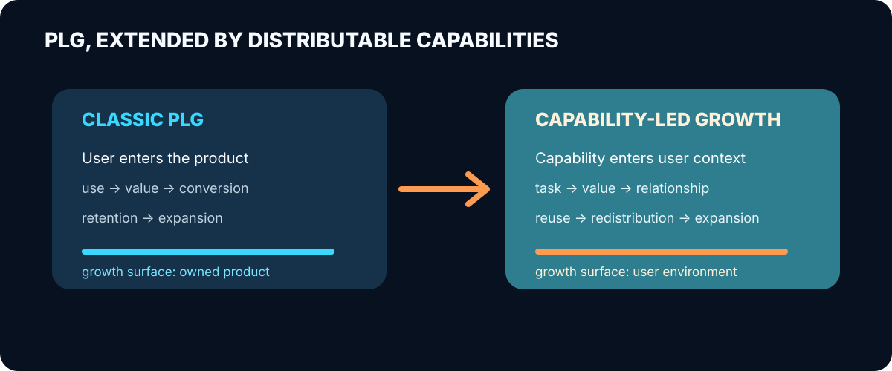

  

# Capability-Led Growth

软件公司习惯先讲价值，再邀请用户进入产品体验价值。

AI 带来了另一种可能：**把一部分能力直接交给用户，让它先为用户工作。**

我最初做了一个企业 AI 场景分析 Skill。它原本只是一个交付工具，却意外表现出营销价值：
潜在客户不必先相信一份白皮书或一场演示，可以直接让它分析自己的企业。一次真实任务，
同时完成了价值交付和能力展示。

这促成了 Capability-Led Growth（CLG）这个设想。它不是要替代 PLG，而是把 PLG 的核心
逻辑推进一步：

> PLG 让产品使用驱动增长；CLG 让可分发的能力使用驱动增长。

更短的定义是：**CLG 是产品体验被封装成可分发能力单元之后的 PLG。**

可安装、可调用、可分享，只说明能力能够流通。CLG 关心的是更具体的结果：它有没有带来
新的使用者，是否促成复用、留资、注册、销售机会或付费。

  

## 这个模型正在怎样变清晰

过去一年出现了不少值得注意的信号。Agent Skills 开始封装流程知识，MCP 处理工具调用，
A2A 描述 Agent 间的协作，厂商也在建设不同类型的目录、验证和治理机制。SenseNova、
Gemini、NVIDIA 等模型厂商还直接发布了成组的 Skills。

它们共同说明，能力正在成为可以被单独设计和分发的产品材料。CLG 研究的重点，不是证明
Skill 会不会成为一个营销渠道，而是沿着这条已经出现的路径，重新设计 AI 时代的 PLG、
用户运营和能力资产管理。

  

我把可以围绕明确任务被单独设计和评估的边界称为“能力单元”。围绕它设计分发、来源归属、
后续承接和反馈机制，就形成一次 **CLG 设计**。把设计放进真实场景、记录结果并继续修改，
就形成一次 **CLG 实践**。CLG 模型会从这些实践中逐渐变得清楚。

这也带来一个新的运营对象：团队不只管理用户账号和完整产品，还要管理每个能力单元从设计、
发布、分发、激活、归因、承接、迭代到退役的生命周期。

CLG 的闭环不以下载和调用结束。它以“有效价值任务”为北极星，继续观察能力是否形成复用、
关系和商业结果，再用增量与经济性决定扩张、迭代或退役。

## 仓库内容

- [CLG 核心文章](./capability-led-growth.zh-CN.md)：这个想法从哪里来，它与 PLG、内容营销
  和免费工具有什么区别。
- [能力单元研究](./capability-unit-thesis.zh-CN.md)：为什么“能力”值得成为产品设计对象，
  以及这个概念最容易被说过头的地方。
- [从 PLG 到分布式能力增长](./distributed-plg-thesis.zh-CN.md)：CLG 如何延伸 PLG，以及
  用户运营和能力生命周期为什么需要重做。
- [CLG 指标与运营闭环](./clg-measurement-and-operations.zh-CN.md)：如何定义北极星、能力
  合格关系、归因、经济性与生命周期决策。
- [思想演进与产品 Roadmap](./thought-roadmap.zh-CN.md)：从企业分析 Skill、营销 Hook 和
  CLG，走向可经营能力与外部产品面。
- [模型升级：从可分发能力到可经营能力](./model-upgrade-operable-capability.zh-CN.md)：
  重新区分 Skill、CLI、MCP、Agent、能力单元和商业闭环。
- [相邻案例谱系](./research/case-patterns.md)：从 Website Grader、Grammarly、Calendly、
  ChatGPT Apps 到 Agent Skills，看这条路径如何逐步出现。
- [CLG 模型审评](./research/model-review-2026-06.md)：当前理论缺口与本轮修正。
- [早期产品个案](./research/skill-marketing-prototype-case.md)：企业分析 Skill 与营销包装
  工具已经发现了什么，又缺少什么。
- [Neta 商业化案例](./research/neta-agent-native-commercialization-case.md)：Skill、CLI、
  身份、状态、计量、社区和支付如何组成 Agent-native 外部产品面。
- [证据地图](./research/evidence-map.md)：相关规范、厂商实践、理论来源和当前证据缺口。
- [SenseNova Skill Pack 个案](./research/sensenova-case-study.md)：从一个模型公司的 Skill
  Pack 看“模型 + 能力包”的产品形态。
- [CLG 研究与迭代方法](./research/model-development-agenda.md)：如何用设计、实践、比较和
  反证逐步发展这个模型。
- [术语表](./GLOSSARY.md)：本文使用的关键概念。

## 当前探索路线

当前先从那些可以快速交付一次完整结果、能够进入用户现有环境、又与后续产品或服务保持
自然连续性的能力开始。它们适合用来观察能力如何成为营销触点，也便于暴露模型缺失的环节。

所以我暂时不做统一的 Skill、MCP、Agent 编辑器。下一步仍围绕现有企业分析 Skill，但验证
目标从“加入营销 Hook”升级为“跑通一条最小可经营链路”：完成有效价值任务，保存或继续
报告，主动建立关系，记录价值与成本，并自然承接深度分析或服务。CLI 将作为执行适配器进入
研究，但不预设为最终用户体验。

我认为这条路径成立：当能力可以独立流通，PLG 就不会只发生在完整产品内部。接下来的工作
不是继续发明概念，而是把能力如何获客、交付、形成关系、保存状态、承接商业结果并被持续
运营讲清楚，再用真实实践决定哪些机制值得抽象为产品。

## License

[CC BY 4.0](./LICENSE)
