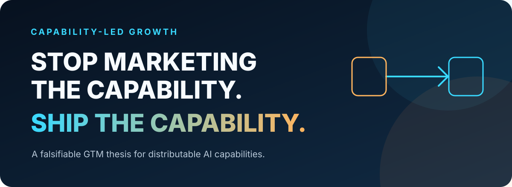
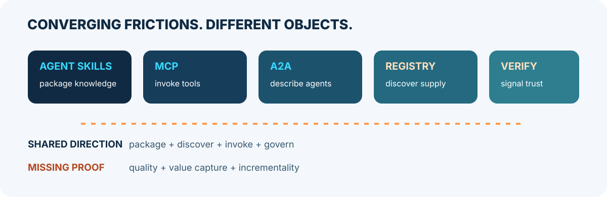

<p align="center">
  
</p>

# Capability-Led Growth

> **不要只传播能力主张。让一部分真实能力进入用户环境，完成任务并证明价值。**

Capability-Led Growth（CLG，能力驱动增长）是一个面向 AI-native 产品的、**仍待验证的
GTM 模型**：企业把产品或专业服务中的一部分能力设计成可独立寻址和分发的单元，让潜在
用户在进入完整产品前先获得实际结果，再检验这次能力使用能否带来增量发现、转化与扩张。

这不是“给 Skill 加广告”，也不是宣称 Skill、MCP、Agent 正在合并成一种技术对象。

## 当前结论

| 证据等级 | 现在可以说什么 |
|---|---|
| **事实** | Agent Skills、MCP、A2A 与不同类型的 Registry 已分别提供封装、调用、描述或发现机制 |
| **推断** | 这些机制可能降低部分能力产品化摩擦，并创造新的 GTM 实验空间 |
| **假设** | CLG 能比内容、普通免费工具或产品试用带来更强的增量增长 |
| **尚不能主张** | 存在统一的 Capability Unit 标准，或能力市场已经形成网络效应 |

<p align="center">
  
</p>

## 四层边界

| 层次 | 核心问题 |
|---|---|---|
| **Capability Artifact** | 是否存在可加载或调用的知识、流程、工具或 Agent？ |
| **Capability Unit** | 是否形成可独立寻址、可分发、可评估的结果导向产品边界？ |
| **Governed Capability** | 是否有版本、评测、权限、风险、来源与生命周期治理？ |
| **CLG Candidate** | 是否完成增长设计并预注册增量实验，等待结果验证？ |

**技术格式不是增长模型。** Skill 可以承载流程知识，MCP 可以提供调用接口，A2A 可以描述
Agent 能力，Registry 可以支持不同范围的发现或治理。CLG Candidate 只是实验处理组；
只有实验观察到可归因的增量增长，才能说 CLG motion 在该场景成立。

## 阅读路径

| 文档 | 内容 |
|---|---|
| [CLG 核心文章](./capability-led-growth.zh-CN.md) | 从 Aha Moment 到增长循环、边界、指标与实验 |
| [能力单元研究论文](./capability-unit-thesis.zh-CN.md) | 理论基础、协议边界、战略含义与反方判断 |
| [证据地图](./research/evidence-map.md) | 一手资料、证据强弱、能证明什么与不能证明什么 |
| [SenseNova Skill Pack 个案](./research/sensenova-case-study.md) | 模型公司为什么开始分发能力包，以及它尚未证明什么 |
| [证伪议程](./research/falsification-agenda.md) | 把 CLG 从叙事变成实验的研究设计 |
| [术语与边界](./GLOSSARY.md) | Capability Unit、CLG Candidate、Skill、MCP、A2A、Agent 的边界 |

## 最小研究链路

```text
可分发能力 ≠ CLG

Capability Unit
→ 加入分发、归属、价值连续性与测量设计
→ 成为 CLG Candidate
→ 与基线进行增量实验
→ 观察 CLG motion 是否在该场景成立
```

失败样本仍然属于 CLG Candidate，不能因结果不理想而被事后排除。

## 起源与研究状态

CLG 来自 `enterprise-ai-scenario-analyzer` 与 `skill-asset-operations-tool` 的实践观察。
SenseNova、Google Gemini 与 NVIDIA 的公开 Skills 仓库提示：至少部分模型厂商正在实验
“模型 + 可复用能力包”。这些案例展示了**能力产品化的可构造形态**，尚未证明普遍采用
或 CLG 的增长效果。

本仓库将持续收集反例、对照实验和真实单位经济数据。没有增量证据，就没有 CLG。

## License

[CC BY 4.0](./LICENSE)
