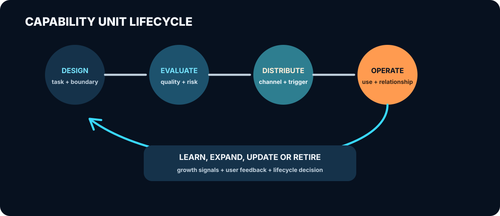

# Capability-Led Growth：让能力先为用户工作

传统营销先传播价值主张，再邀请用户体验产品。

PLG 把产品使用放到增长中心。

AI 又带来了一种可能：**产品的一部分能力，可以离开产品，主动进入用户的工作环境。**

## 这个想法从哪里来

我最初做了一个企业 AI 应用场景分析 Skill。用户输入一家企业的名称，它会调研公开信息、
分析业务流程，最后生成一张 AI 应用场景地图。

它原本只是一个提高交付效率的工具。做完以后，我才意识到，它同时也在展示提供方的专业
判断能力。

一个潜在客户不必先读完白皮书，也不必先相信销售演示。他可以直接让这个 Skill 分析自己
的企业。能力有没有价值，不再只由提供方描述，而是在一次真实任务里被体验。

Skill 还可以被安装、复制、分享和再次调用。它有机会离开最初的发布页面，进入新的用户
环境，继续完成任务。

由此产生了 Capability-Led Growth（CLG，能力驱动增长）这个设想：

> PLG 让产品使用驱动增长；CLG 让可分发的能力使用驱动增长。

## CLG 改变了什么

内容营销、PLG 和 CLG 都在帮助用户理解产品价值，区别在于价值如何抵达用户。

```text
内容营销：企业解释自己能做什么

PLG：用户进入产品，使用产品并获得价值

CLG：一部分能力进入用户环境，先完成任务，再连接完整产品或服务
```

CLG 并不是 PLG 的替代品。它延续了 PLG 最重要的判断：用户应该先从使用中获得价值，增长
再从真实使用中发生。区别在于，PLG 通常把用户带进产品，CLG 则把一部分产品能力送到用户
已经工作的地方。

| 维度 | 经典 PLG | CLG |
|---|---|---|
| 增长单元 | 完整产品或产品功能 | 可独立分发的能力单元 |
| 首次价值发生地 | 产品自有入口 | 用户、Agent 或合作伙伴环境 |
| 主要触发 | 注册、试用、邀请 | 任务意图、安装、调用、推荐 |
| 运营对象 | 用户与账号生命周期 | 用户关系与能力单元生命周期 |
| 增长信号 | 激活、留存、扩张、PQL | 有效任务、复用、再分发、关系延续 |

多数情况下，CLG 是 PLG 或销售流程之前的一段路：先用一个具体结果建立价值认知，再由完整
产品、服务或销售承接后续关系。

这种路径也不由技术格式决定。Skill 可以封装工作方法，MCP 可以提供工具调用，Agent
可以组织完整任务，API 和扩展也可以成为载体。它们能否参与增长，取决于用户是否获得
结果，以及结果之后是否发生了复用、注册、留资、销售机会或付费。

## 为什么 AI 让这件事值得重看

过去，企业很难把专业能力拆出来单独分发。

软件功能通常依赖完整界面、账号体系和数据集成；专业服务依赖专家本人。于是企业最容易
规模化传播的，往往只是能力的描述：文章、案例、白皮书和演示。

生成式 AI 改变了部分成本结构。一套研究流程、评估方法、写作规范或决策框架，可以与
模型、工具和参考资料组合，反复处理不同用户的真实问题。

专业方法不再只能存在于文档和专家经验中。它可以被包装，进入用户已经使用的环境，并用
用户自己的上下文完成任务。白皮书对所有人讲同一套话，能力单元则可以为眼前这个用户
工作。

这里最有吸引力的变化，是价值交付与价值展示发生在同一次任务中。用户调用它是为了完成
工作，而不是观看营销材料。任务结果可能比营销主张更有说服力。它怎样影响认知、关系和
转化，则需要在持续实践中逐渐回答。

## 一条完整的增长路径

一个可下载的 Skill 还不是 CLG。它只是一个可以被分发的制品。

一次完整的 CLG 设计，至少要考虑以下路径：

```text
选择合适的能力
→ 进入真实分发渠道
→ 快速完成第一次有意义的任务
→ 让用户理解结果来自谁、为什么可信
→ 自然连接到下一步产品或服务
→ 产生复用、分享、转化或扩张
```

### 先选对能力

适合被拆出的能力，既不能太轻，也不能太重。

太轻，只会生成一份泛化结果，无法展示差异；太重，则需要复杂配置、敏感数据和大量人工
介入，失去低摩擦优势。一个好的入口，应该能独立完成一次有意义的任务，同时让用户看到
完整产品还能继续解决什么。

把 Skill 放到 GitHub 或目录里，只说明它可以下载。分发要解决的是谁会在什么时刻发现它，
为什么愿意调用，以及它是否进入了原本触达不到的环境。下载、安装和 Star 都可能很好看，
但首次任务是否成功、多久得到有意义的结果、用户有没有采用或分享结果，更接近真实价值。

能力进入第三方环境后，提供方很容易失去身份和用户关系；粗暴插入品牌、链接和行动按钮，
又会污染结果。更自然的归属来自方法说明、结果解释、责任边界和后续支持。用户知道能力
来自谁，应该因为来源信息有助于理解和使用结果，而不是因为 Logo 出现了很多次。

后续承接也应该从当前结果里长出来。分析已经解决了什么，哪些问题还需要更多数据、持续
监测、团队协作或专业服务？转化不是把用户从任务中拉走，而是帮助他继续完成任务。

## 从哪些场景开始探索

CLG 更适合那些能够快速交付完整结果，又与后续产品保持连续性的能力。

| 场景 | 可能的能力入口 |
|---|---|
| B2B 软件与专业服务 | 配置审计、风险评估、数据分析、方案预览、行业基准 |
| 教育 | 作业反馈、知识点识别、学习路径、模拟练习 |
| 消费服务 | 需求匹配、购买辅助、个性化规划、初步评估 |
| 开发者产品 | 代码检查、配置生成、迁移评估、集成助手 |

行业不是决定因素。更重要的是，用户能不能很快得到有意义的结果，结果能不能体现提供方
的差异，能力能不能进入用户已经工作的地方，以及使用之后有没有自然、可测量的下一步。

## CLG 与免费工具的区别

CLG 和免费工具的边界并不总是清楚，这也是这个概念最容易失去解释力的地方。

如果一个工具只能在供应商网站使用，主要承担试用入口，它通常仍属于 PLG 或免费工具营销。
CLG 关注的是另一种情况：能力离开供应商入口，进入用户或第三方环境，并在那里
继续完成任务。

“离开产品”是关键的结构变化，但不是最终目标。一次有效的 CLG 实践，仍然要带来原本不会
发生的有效使用和后续关系。

同样，可分享不等于裂变。裂变要求分享持续产生新的有效使用。没有传播数据以前，最多只能
说能力具备再分发条件。

## 重新理解营销 Hook

`skill-asset-operations-tool` 最初试图为 Skill 注入营销钩子（Hook）。这个方向仍然有
价值，但 Hook 不应该被理解为“在输出里多放几个品牌和转化入口”。

更准确地说，这个工具需要处理来源、承接、分发和反馈。用户应该知道能力由谁提供、采用
什么方法；下一步应该与当前结果相关；分享和再次调用应该足够顺畅；团队也需要知道哪些
任务真正产生了复用、注册、留资、销售机会或付费。

这类机制不该按数量或“注入强度”衡量。它们首先要与用户意图相关，不能破坏结果。

当能力数量增加以后，问题也不再只是“有没有 Hook”。团队需要知道每个能力为何存在、面向
谁、在哪些渠道分发、当前质量如何、带来了什么关系、何时需要更新或退役。这是能力单元
生命周期管理，也是 CLG 对用户运营提出的结构性要求。

<p align="center">
  
</p>

## 指标必须形成闭环

CLG 不能用下载量、安装量和调用量证明有效。它需要先定义一次能力使用何时真正为用户创造
价值，再观察价值是否形成关系和商业结果。

建议把 **有效价值任务** 作为北极星：能力成功完成用户原本要解决的任务，并出现保存、采用、
分享、继续任务或复用等结果采用信号。

围绕它建立五层指标：

```text
发现：是否在正确意图下被看到和调用
→ 价值：是否快速完成有效价值任务
→ 关系：是否产生复用、分享和自然后续动作
→ 商业：是否形成能力合格关系、销售机会、付费或扩张
→ 经济性：增量结果是否覆盖运行与运营成本
```

这套指标最终必须改变能力生命周期决策。高调用、低价值说明触发失准；高价值、低关系说明
承接缺失；关系增长但没有增量商业结果，需要检查商业连续性与归因；长期低价值、高成本或
高风险的能力应当合并、暂停或退役。

完整框架见[《CLG 指标与运营闭环》](./clg-measurement-and-operations.zh-CN.md)。

## 从可分发能力到可经营能力

Neta Skills 提供了一个比“Skill 作为营销触点”更完整的现实案例。它把路由 Skill、聚焦
子 Skill、CLI、API、OAuth、使用计量、作品资产、社区发现、套餐、订单和支付连接在一起。

这迫使 CLG 区分三个层次：

- **能力单元**是围绕明确任务形成的设计和评测边界；
- **可经营能力单元**能够进一步连接身份、同意、状态、计量、关系承接和商业化；
- **外部产品面**由多个可经营能力及共享基础设施组成，进入用户已有 Agent、CLI 或工作流。

CLG 仍然负责解释增长如何发生。可经营能力是运营对象，外部产品面是产品结构。Skill、
CLI、MCP、API、Agent 和 Web 并不是彼此替代的同类载体，而是在结构中承担不同职责。

这也修正了当前产品方向：营销 Hook 编辑器不再是最高层定义，而应成为可经营能力设计中的
一个模块。完整升级见[《模型升级：从可分发能力到可经营能力》](./model-upgrade-operable-capability.zh-CN.md)
和 [Neta 商业化案例](./research/neta-agent-native-commercialization-case.md)。

## 实践会暴露哪些问题

CLG 的风险并不少。

能力可能交付了大量免费价值，却没有形成后续关系；用户也可能复制和修改 Skill，移除所有
归属信息。第三方运行时可能控制发现、身份和数据，让能力提供方承担成本，却无法接触用户。

平台规则和格式也会变化。今天有效的分发入口，明天可能被弃用。签名和验证能够提供来源
或局部质量信号，却无法保证未来表现，更无法保证多个能力组合后的可靠性。

对模型公司而言还有一个更尖锐的问题：能力包可以帮助用户采用模型，也可能让模型更容易
被替换。如果真正有价值的是可移植工作流，而底层模型差异不大，能力包会加速模型商品化。

因此，可靠壁垒不会来自不可删除的品牌文字，也不会来自 Skill 数量。它更可能来自持续
更新、专有数据、真实任务评测、可信方法和完整产品关系。

## 如何让探索不断积累

CLG 不是等待一次实验宣判的命题，而是一套要从真实使用中逐渐长出来的营销模型。在建设
通用平台之前，先把一条具体增长链路设计完整，能让我们更快看见模型中哪些部分有效、哪些
部分缺失。

对照实验是其中一种重要方法。最简单的做法，是为同一项能力准备两个版本：

- 对照组留在供应商入口；
- 实验组进入用户已有环境；
- 任务、输出、后续入口、交付价值和分发渠道尽量保持一致。

然后观察实验组是否带来更多首次有效任务、30 天复用、注册、留资、销售机会和付费，同时
记录推理、审核、支持和人工介入成本。

如果没有增量，结果不只是“CLG 失败了”。它应该帮助我们区分问题来自能力切片、分发场景、
来源归属、后续承接，还是成本结构。反证的作用是阻止模型自我辩护；案例比较、设计迭代和
长期数据则帮助模型继续发展。完整方法见
[《CLG 研究与迭代方法》](./research/model-development-agenda.md)。

## 回到当前项目

企业 AI 场景分析 Skill 仍然是最合适的第一个实验对象。它已经把咨询服务中的公开信息
调研、业务流程分析、AI 场景识别和优先级建议组合成一次可体验的交付。

下一步不是继续扩张通用编辑器，而是把这条路径跑完整：

1. 明确能力边界和质量标准；
2. 做出供应商入口版本与可分发版本；
3. 设计不破坏结果的来源和后续承接；
4. 记录有效任务、成本、复用、注册、留资、销售机会和付费；
5. 根据结果修改能力边界、分发、承接和测量设计。

这项实践不只负责给出“有用”或“没用”的结论。即使没有产生增长，它也能帮助判断能力为何
没有成为关系入口。多轮实践积累后，再抽象 Skill Pack、能力治理和跨载体运营工具，才会
知道哪些是通用机制，哪些只是当前 Skill 的局部需求。

## 这个模型接下来要长成什么

AI 正在让一部分产品能力从完整应用和专家服务中被拆出来，成为可以单独设计和分发的对象。
这些能力会被单独设计、评测、治理和分发，也可能成为新的营销触点。

CLG 当前是一套从 PLG 延伸出来的工作模型，用来解释企业如何选择能力、把它送到用户身边、
完成第一次价值交付，并延续后续关系。它还不完整，但方向已经足够明确：AI 时代的营销资产
不再只传播信息，也可以直接执行任务；用户运营不再只围绕账号，也要围绕一次次能力使用
建立关系。

当前项目要做的，是用企业分析 Skill 持续打磨这条路径，再把反复出现的机制抽象出来。我们
接受具体设计失败，也接受理论被修正，但公开工作的目标始终是把这套 PLG 延伸理论讲得更
清楚、做得更完整。

---

## 延伸阅读

- [能力单元：AI 产品正在出现的新边界](./capability-unit-thesis.zh-CN.md)
- [从 PLG 到分布式能力增长](./distributed-plg-thesis.zh-CN.md)
- [CLG 指标与运营闭环](./clg-measurement-and-operations.zh-CN.md)
- [相邻案例谱系](./research/case-patterns.md)
- [CLG 模型审评](./research/model-review-2026-06.md)
- [早期产品个案](./research/skill-marketing-prototype-case.md)
- [证据地图：能力产品化与 CLG](./research/evidence-map.md)
- [SenseNova Skill Pack：模型公司为什么开始交付“能力”](./research/sensenova-case-study.md)
- [CLG 研究与迭代方法](./research/model-development-agenda.md)
- [术语与边界](./GLOSSARY.md)
