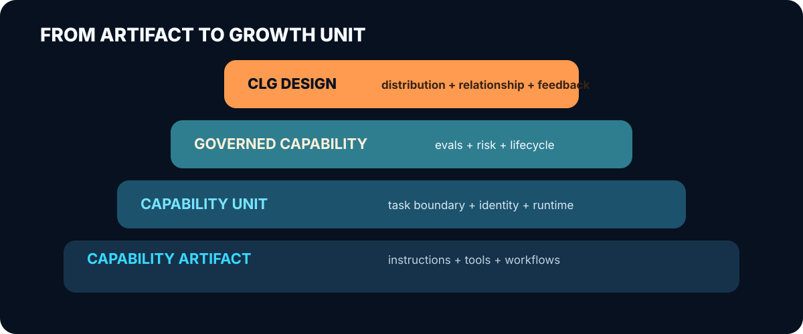

# 能力单元：AI 产品正在出现的新边界

最近讨论 Skill、MCP 和 Agent 时，人们很容易被技术名词带着走：它们分别是什么、谁会
成为标准、哪一种会赢。

我更关心另一个问题：

> 当流程知识、工具调用和模型能力都可以被重新组合时，产品还必须以“完整应用”为唯一
> 边界吗？

SenseNova Skill Pack 让我重新注意到这个问题。它不是简单地给模型附上一批 Prompt，
而是把底层模型能力、工作流、任务入口和路由组织到了一起。用户面对的不再只是模型，
而是一组已经被包装好的工作能力。

我暂时把这种可以被单独设计、分发和评估的产品边界称为 **Capability Unit，能力单元**。
它是一个分析工具，不是行业标准。

## 什么算能力单元

一个能力单元首先要围绕任务成立。

它可以依赖模型、运行环境、工具、权限和数据，不必假装自己能够独立运行；但产品团队应该能够
单独回答这些问题：

- 它为谁完成什么任务？
- 需要哪些依赖和权限？
- 用户如何找到并调用它？
- 哪些运行环境得到支持？
- 结果质量、成本和风险如何评估？
- 谁对版本、来源和后续维护负责？

如果这些问题只能在完整产品层回答，它更像内部组件。能够被单独回答，才说明这里出现了
一个值得经营的产品边界。

“能力单元”也不是越小越好。实际价值常常来自多个步骤、上下文和人工判断的组合。边界的
意义，在于让产品团队可以清楚地决定如何发布、如何评估、如何治理，而不是追求某种技术
原子。

## 为什么这个问题现在变得重要

过去，要把一部分专业能力从产品或服务中拆出来，成本通常很高。软件功能依赖完整界面和
账号体系，咨询能力依赖专家本人。企业最容易分发的是能力的描述：文章、案例、白皮书和
演示。

生成式 AI 改变了这里的成本结构。一套研究流程、分析方法或交付规范，可以被写进 Skill；
外部系统可以通过 MCP 被调用；Agent 可以通过 A2A 描述自己的身份和行为；目录、签名和
评测机制也开始出现。

这些东西处在不同层次：

| 机制 | 它主要解决什么 |
|---|---|
| Agent Skills | 如何封装和加载流程知识 |
| MCP | Agent 如何调用工具和上下文 |
| A2A | Agent 如何描述自己并与其他 Agent 协作 |
| Skill Registry | 如何发现和管理某类 Skill 或领域逻辑 |
| MCP Server Registry | 如何发现 MCP Server |
| Verified Skill | 如何提供特定平台范围内的信任信号 |

它们没有组成一个统一的能力标准。更准确的说法是：过去缺失的若干基础构件，正在分别
出现。至于它们是否真的降低开发、采用和治理成本，还需要实际数据。

## 这个概念从哪里获得解释力

能力单元并不是凭空创造的新理论。模块化研究早已说明，模块的价值来自清晰边界、接口和
设计规则。分层模块化数字架构则解释了为什么协议、服务、内容和设备可以处在不同层次，
同时保持松耦合。

服务主导逻辑提供了另一个重要视角：价值不是放在商品里等用户接收，而是在使用情境中
实现。对 CLG 而言，这意味着一次真实任务可能比一段营销主张更接近价值本身。但“更接近”
不等于“转化更好”，后者只能通过实验判断。

平台经济也提醒我们不要只看供给数量。目录里有一万个 Skill，不代表市场已经形成。发现、
匹配、信任、责任和交易成本如果没有被解决，更多供给反而可能制造更多噪声。

## 从能力单元到增长入口

  

能力能够被单独发布，并不意味着它天然适合增长。

当团队为它设计分发渠道、来源归属、后续承接和测量方式时，就形成了一次 **CLG 设计**。
当这套设计进入真实场景、产生使用数据并接受修改时，就形成了一次 **CLG 实践**。

CLG 真正要回答的是：能力进入用户环境以后，是否形成了原本不会发生的新关系？

## SenseNova 改变了什么判断

SenseNova Skill Pack 展示了一种值得重视的产品形态：

- 底层 Skill 封装模型或 API 能力；
- 工作流 Skill 负责研究、图像、表格和演示等多阶段任务；
- 入口 Skill 根据意图选择合适流程；
- 子能力按需加载，并共享模型与工具。

这使“模型 + 能力包”不再只是概念。至少部分模型厂商已经在用公开仓库实验这种形态。

公开仓库看不到能力级增长归因，也不足以判断跨运行时质量、生命周期治理和商业转化。
SenseNova 最有价值的地方，是把这种产品形态具体地展示了出来。

## 模型公司的两难

能力包能够降低用户理解和使用模型的门槛，也可能降低更换模型的门槛。

如果 Skill 把最佳流程完整地开放出来，而底层模型可以轻易替换，模型会更像运行时。反过来，
如果某个模型在特定能力上持续表现出更好的质量、成本和可靠性，能力包就会成为展示差异的
最好界面。

所以，壁垒不在 Skill 数量。它更可能来自：

- 针对真实任务积累的评测和反馈；
- 难以复制的数据与工作流；
- 可持续更新和治理能力；
- 用户对来源、质量和责任的信任；
- 能力使用之后仍能延续的产品关系。

## 能力单元在 CLG 中的作用

能力单元是当前研究中最有用的工作抽象。它让团队能够选择一个具体任务，围绕它设计分发、
体验、归属、承接和反馈，再观察这套设计如何影响用户关系。

它不意味着能力目录天然会形成市场，也不意味着能力使用天然会带来增长。对当前项目来说，
最有价值的工作，是选一个现有 Skill，把跨运行时质量、采用成本和增长关系真正做一遍，
再让结果反过来修改“能力单元”与 CLG 的定义。

相关来源见[证据地图](./research/evidence-map.md)，研究方法见
[CLG 研究与迭代方法](./research/model-development-agenda.md)，PLG 主线见
[从 PLG 到分布式能力增长](./distributed-plg-thesis.zh-CN.md)。
