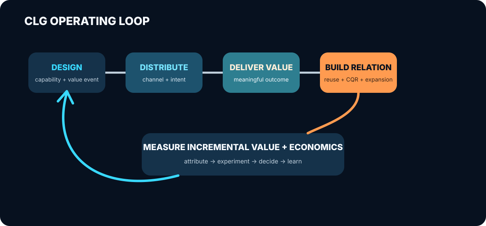

# CLG 指标与运营闭环

CLG 如果只有“把能力分发出去”的理论，还不是一个完整的增长模型。

增长模型必须回答三件事：

1. 用户是否真的从能力中获得了价值；
2. 这次价值是否形成了可延续的关系；
3. 这段关系是否为企业带来了增量商业结果。

当前 CLG 文档已经覆盖能力、分发、关系和生命周期，但指标仍像一张清单：有效任务、复用、
分享、注册、留资、销售机会、付费、成本都值得记录，却没有说明哪一个指标负责指导方向、
它们之间如何连接，以及什么结果应该触发下一步决策。

这份文档补上运营闭环。

<p align="center">
  
</p>

## 北极星：有效价值任务

CLG 的北极星指标不应该是 Skill 下载量、安装量、调用量或输出数量。这些指标可以增长，
用户却未必获得价值。

更合适的北极星是：

> **有效价值任务（Meaningful Capability Outcome）**：能力成功完成了用户原本要解决的
> 任务，并出现至少一个结果采用信号。

结果采用信号需要按能力定义。例如：

- 报告被保存、导出、分享或用于后续决策；
- 建议被执行；
- 生成内容被采用或继续编辑；
- 分析结果触发了后续任务；
- 用户在合理周期内为同类任务再次调用。

团队可以使用“每周有效价值任务数”作为北极星计数，但不能只追求数量。它必须同时受到质量、
信任、安全和经济性护栏约束。

### 为什么不是调用量

调用量描述系统工作了多少次，有效价值任务描述用户获得了多少次真实结果。两者之间的差距，
正是能力设计和运营需要解决的问题。

```text
调用量上升 + 有效价值率下降 = 分发或触发失准
调用量稳定 + 有效价值率上升 = 能力质量改善
有效价值上升 + 关系延续下降 = 承接设计缺失
关系延续上升 + 商业增量缺失 = 商业连续性或归因有问题
```

## 指标树：从价值到商业结果

北极星指标需要一组输入指标和结果指标共同解释。CLG 指标树分为五层。

| 层级 | 核心问题 | 建议指标 |
|---|---|---|
| 发现 | 能力是否在正确意图下被看到和调用 | 有效发现数、相关触发率、发现到启动率 |
| 价值 | 用户是否获得了有意义的结果 | 有效价值率、首次价值时间、结果采用率、质量通过率 |
| 关系 | 一次使用是否延续为后续关系 | 复用率、关系承接率、来源识别率、能力再分发系数 |
| 商业 | 关系是否产生商业结果 | 能力合格关系数、销售机会率、付费率、扩张率、增量收入 |
| 经济性 | 这条路径是否值得持续经营 | 单次有效价值成本、单个能力合格关系成本、增量毛利、回收期 |

### 每个指标都需要分母

“产生了 20 个销售机会”不能说明能力是否有效。团队至少需要知道它来自多少次相关发现、
多少次任务启动、多少次有效价值和多少段可识别关系。

```text
有效价值率 = 有效价值任务 / 任务启动

关系承接率 = 发生后续关系的有效价值任务 / 有效价值任务

复用率 = 在规定周期再次完成有效价值任务的关系 / 首次有效价值关系

商业转化率 = 形成付费或销售机会的能力合格关系 / 能力合格关系
```

没有稳定分母时，绝对数量仍可用于早期观察，但不能用于比较渠道、能力版本或生命周期决策。

### 再分发必须形成增长循环

可分享不等于裂变。CLG 真正关心的是一次有效价值是否带来下一次有效价值。

```text
能力再分发系数
= 由分享、推荐或嵌入带来的新有效价值任务
  / 产生过分享、推荐或嵌入的有效价值任务

能力循环周期
= 从一次有效价值任务到它带来下一次有效价值任务的平均时间
```

再分发系数衡量循环强度，循环周期衡量循环速度。下载、Fork 和分享仍可作为前置信号，但只有
新的有效价值任务进入循环，才构成增长。

## 从 PQL 到能力合格关系

Product-Led Sales 使用 PQL（Product-Qualified Lead）把产品使用、客户匹配和购买意图结合
起来。CLG 需要一个类似但更早发生的运营对象：

> **能力合格关系（Capability-Qualified Relationship，CQR）**：用户或组织已经通过能力
> 获得真实价值，同时表现出匹配度、持续任务需求或明确后续意图，并同意建立进一步关系。

CQR 不是“调用过 Skill 的人”，也不是所有匿名使用者。有效价值是必要条件；在此基础上，
匹配或意图至少有一项成立，并且用户同意建立进一步关系：

| 维度 | 可能信号 |
|---|---|
| 价值 | 完成有效价值任务、采用结果、再次调用 |
| 匹配 | 属于目标行业、角色、组织规模或任务类型 |
| 意图 | 请求更深分析、连接数据、团队协作、咨询、产品试用或报价 |

同意和关系建立是必要条件。不能因为用户在第三方 Agent 中调用了能力，就把他的任务内容、
身份或敏感数据自动变成销售线索。

## 归因：先记录关系，再证明增量

能力使用到商业结果之间通常跨越多个环境，单纯依赖最后点击会高估或低估 CLG。

更稳妥的归因方法分四层：

| 层级 | 回答的问题 | 方法 |
|---|---|---|
| 直接归因 | 哪次能力使用直接产生了下一步动作 | 带来源的深链、明确 CTA、用户主动连接 |
| 辅助归因 | 能力是否参与了关系和交易 | CRM 触点、用户自报、销售记录、时间窗口 |
| 增量实验 | 如果没有这次能力分发，结果是否仍会发生 | 对照组、交替分发、渠道或地区实验 |
| 模型估计 | 无法逐次识别时，整体贡献有多大 | 聚合数据、因果模型、营销组合模型 |

直接归因适合日常运营，增量实验负责判断因果。两者不能互相替代。

对第三方运行时尤其要接受一个现实：有些发现和使用无法被完整观测。此时应该明确标记
“未知”，而不是把不可见使用计为零，也不能用少数可识别用户代表全部用户。

## 经济性：增长不等于可持续

AI 能力每次运行都可能产生推理、工具、数据、审核、支持和人工服务成本。免费使用越多，
不一定越好。

每个能力单元至少应记录：

```text
单次有效价值成本
= 能力总运行与运营成本 / 有效价值任务

单个能力合格关系成本
= 能力设计、分发与运营成本 / 新增 CQR

能力增量毛利
= 可归因增量收入 - 交付与运营可变成本

能力回收期
= 累计投入 / 月度能力增量毛利
```

早期数据不足时，可以先记录成本和关系结果，不必假装已经能精确计算 ROI。但一项能力长期
只有调用，没有有效价值、关系或经济回报，就不应因为下载量好看而继续扩张。

## 生命周期决策：指标必须改变行动

指标只有改变决策，才能形成闭环。每个能力单元应按阶段设置门槛。

| 阶段 | 主要判断 | 典型决策 |
|---|---|---|
| 设计 | 任务是否明确，结果是否与后续产品连续 | 继续设计、重新切片、放弃 |
| 评测 | 质量、安全、成本是否达到发布要求 | 发布、修复、限制场景 |
| 分发 | 是否被正确发现并顺利启动 | 优化描述、渠道、触发与安装 |
| 激活 | 用户是否快速获得有效价值 | 优化输入、流程、输出与首次价值时间 |
| 关系 | 是否产生复用、分享和自然后续动作 | 优化归属、承接和用户运营 |
| 扩张 | 是否产生增量商业结果且经济性合理 | 扩大渠道、增加版本、销售承接 |
| 退役 | 是否长期低价值、高成本或高风险 | 合并、暂停、退役 |

门槛不能直接照抄行业平均值。不同能力的使用频率、价值周期和商业连续性不同。企业分析
Skill 可能按季度复用，写作辅助能力可能每天复用。正确做法是先定义预期行为，再按能力类型
建立基线和对照。

## 最小事件契约

要运营能力生命周期，工具需要记录最小但一致的事件。建议从以下字段开始：

| 字段 | 说明 |
|---|---|
| `capability_id` / `version` | 哪个能力与版本 |
| `channel` / `runtime` | 从哪里发现并运行 |
| `task_class` | 任务类型，不记录不必要的原始敏感内容 |
| `started_at` / `completed_at` | 启动、完成和首次价值时间 |
| `outcome_status` | 成功、部分成功、失败及原因 |
| `adoption_signal` | 保存、分享、采用、继续任务或复用 |
| `relationship_signal` | 用户主动连接、请求下一步或同意跟进 |
| `cost` | 推理、工具、审核、支持和人工成本 |
| `consent_scope` | 用户同意记录和使用哪些数据 |

事件设计遵循两个原则：

1. 先记录完成闭环所需的最小数据；
2. 不为了增长归因收集与任务无关的身份和敏感内容。

## 当前企业分析 Skill 的第一版仪表盘

第一轮不需要几十个指标。建议只看以下十项：

| 类型 | 第一版指标 |
|---|---|
| 北极星 | 每月有效价值任务数 |
| 价值 | 有效价值率、首次价值时间、报告采用率 |
| 关系 | 90 天复用率、关系承接率、能力带来新有效任务数 |
| 商业 | CQR 数、CQR 到销售机会率 |
| 经济性 | 单次有效价值成本、单个 CQR 成本 |

同时保留质量、安全、投诉和人工介入作为护栏。任何增长优化都不能以明显降低报告可信度或
增加用户风险为代价。

## 一个完整的运营周期

```text
定义能力的价值事件与预期关系
→ 发布并记录最小事件
→ 按能力版本、渠道和用户任务建立 cohort
→ 找到最大流失点或高价值行为
→ 修改能力、分发或承接设计
→ 用对照实验检查增量
→ 根据价值、关系、商业与经济性决定扩张、迭代或退役
```

这个循环是 CLG 从理论走向运营模型的关键。能力不是发布以后等待下载的营销材料，而是一项
持续产生价值、关系、数据和决策的增长资产。

## 参考框架

- [Amplitude North Star Framework](https://amplitude.com/books/north-star/about-north-star-framework)
- [Amplitude：Time to Value](https://amplitude.com/blog/time-to-value-drives-user-retention)
- [Pocus：Product-Qualified Leads](https://www.pocus.com/blog/pql-guide-part-3-advanced-product-qualified-lead-scoring-concepts)
- [Reforge：Growth Loops](https://www.reforge.com/artifacts/c/growth/growth-loop)
- [Meta：Conversion Lift](https://www.facebook.com/business/measurement/conversion-lift)
- [Google Meridian：Causal Inference](https://developers.google.com/meridian/docs/causal-inference/intro)
